# AGENTS.md

Project knowledge base for AI coding agents.

## Project Overview

**cubrid-benchmark** is a unified, multi-language benchmark suite measuring CUBRID database
performance against MySQL across Python, Go, and TypeScript driver/ORM stacks.

- **Languages**: Python 3.10+, Go 1.21+, TypeScript/Node.js 18+
- **Databases**: CUBRID 11.2, MySQL 8.0
- **License**: MIT

## Architecture

```mermaid
flowchart TD
    ROOT["cubrid-benchmark/"]

    DOCKER["docker/<br/>compose.yml<br/>CUBRID 11.2 + MySQL 8.0"]
    SCHEMA["schema/<br/>cubrid_init.sql, mysql_init.sql, seed.sql"]
    PY["python/<br/>conftest.py, bench_pycubrid.py, bench_pymysql.py,<br/>bench_sqlalchemy.py, requirements.txt"]
    GO["go/<br/>cubrid_bench_test.go, mysql_bench_test.go,<br/>gorm_bench_test.go, go.mod"]
    TS["ts/<br/>bench_cubrid.ts, bench_mysql.ts, bench_drizzle.ts,<br/>package.json, tsconfig.json"]
    SCRIPTS["scripts/<br/>wait_for_db.sh, normalize_results.py"]
    MAKE["Makefile<br/>make tier0, make tier1-python, make all, etc."]
    GH[".github/workflows/<br/>bench.yml<br/>Nightly CI + GitHub Pages publish"]
    PRD["PRD.md"]
    AGENTS["AGENTS.md"]
    README["README.md"]
    LICENSE["LICENSE"]
    GITIGNORE[".gitignore"]

    ROOT --> DOCKER
    ROOT --> SCHEMA
    ROOT --> PY
    ROOT --> GO
    ROOT --> TS
    ROOT --> SCRIPTS
    ROOT --> MAKE
    ROOT --> GH
    ROOT --> PRD
    ROOT --> AGENTS
    ROOT --> README
    ROOT --> LICENSE
    ROOT --> GITIGNORE
```



## Module Responsibilities

| Module | Role |
|--------|------|
| `docker/compose.yml` | Spin up CUBRID 11.2 and MySQL 8.0 with health checks |
| `schema/` | Create tables and seed deterministic data for both DBs |
| `python/` | pytest-benchmark based benchmarks for pycubrid, PyMySQL, SQLAlchemy |
| `go/` | `go test -bench` based benchmarks for cubrid-go, go-sql-driver/mysql, GORM |
| `ts/` | tinybench based benchmarks for cubrid-client, mysql2, Drizzle |
| `scripts/normalize_results.py` | Parse pytest-benchmark JSON, Go benchstat, tinybench output → unified JSON |
| `Makefile` | Orchestrate benchmark tiers and database lifecycle |
| `.github/workflows/bench.yml` | Nightly CI: start DBs → run benchmarks → publish to GitHub Pages |

## Development

### Prerequisites

```bash
docker compose -f docker/compose.yml up -d
./scripts/wait_for_db.sh
```

### Key Commands

```bash
make tier0                    # Functional smoke test (all languages)
make tier1-python             # Python driver throughput
make tier1-go                 # Go driver throughput
make tier1-ts                 # TypeScript driver throughput
make tier2-python             # Python ORM overhead
make tier2-go                 # Go ORM overhead
make tier2-ts                 # TypeScript ORM overhead
make all                      # All tiers
make clean                    # Stop containers, remove volumes
```

### Running Individual Benchmarks

```bash
# Python
cd python && pytest bench_pycubrid.py --benchmark-json=results.json -v

# Go
cd go && go test -bench=. -benchtime=10s -count=5 ./...

# TypeScript
cd ts && npx tsx bench_cubrid.ts
```

## Code Conventions

### Style
- Python: Ruff, line length 100, Python 3.10+
- Go: gofmt, Go 1.21+
- TypeScript: ESLint + Prettier, Node.js 18+

### Benchmark Naming Convention

```
bench_{operation}_{scale}_{variant}

Examples:
  bench_insert_10k_sequential
  bench_select_10k_by_pk
  bench_update_1k_where_indexed
  bench_delete_1k_sequential
```

### Result JSON Schema

```json
{
  "name": "insert_10k_sequential",
  "unit": "ops/sec",
  "value": 12345.67,
  "range": "± 2.3%",
  "extra": "language=python driver=pycubrid db=cubrid tier=1"
}
```

## Benchmark Tiers

### Tier 0 — Functional (PR gate)
- Connect to DB
- CREATE TABLE
- INSERT 1 row
- SELECT 1 row
- UPDATE 1 row
- DELETE 1 row
- DROP TABLE

### Tier 1 — Driver Throughput (Nightly)
- INSERT 10K rows (sequential)
- SELECT 10K rows (by PK)
- SELECT 10K rows (full scan)
- UPDATE 1K rows (WHERE indexed)
- DELETE 1K rows (sequential)
- Bulk INSERT 10K rows (batch)

### Tier 2 — ORM Overhead (Nightly)
- Same operations as Tier 1, but via ORM
- Compare: raw driver time vs ORM time

### Tier 3 — Concurrency (Weekly)
- 10 / 50 / 100 parallel connections
- Mixed read/write workload
- Connection pool efficiency

### Tier 4 — Soak/Leak (Weekly)
- 1-hour continuous load
- Memory usage tracking
- Connection leak detection

## Database Connection Info

| Database | Host | Port | Database | User | Password |
|----------|------|------|----------|------|----------|
| CUBRID | localhost | 33000 | benchdb | dba | (empty) |
| MySQL | localhost | 3306 | benchdb | root | bench |

## Comparison Methodology

1. Same schema, same seed data, same operations
2. Same hardware (CI runner), same run
3. Warm-up iterations excluded from measurement
4. Minimum 5 iterations, report median + stddev
5. Results within ±5% considered equivalent

## CI/CD

### Nightly Workflow (`bench.yml`)
1. Start CUBRID + MySQL via Docker Compose
2. Wait for readiness
3. Run schema + seed
4. Execute Tier 0 (gate), then Tier 1 + Tier 2
5. Normalize results to JSON
6. Publish to GitHub Pages via `github-action-benchmark`

### PR Workflow
- Tier 0 only (functional gate)
- Comment with regression alert if > 10% slower

## Anti-Patterns
- No hardcoded absolute performance expectations (hardware varies)
- No cross-language ranking (apples vs oranges)
- No benchmark results in committed files (generated in CI only)
- No `time.Sleep` in benchmarks (use proper warm-up)

## Competition Context (공모전 — Performance Loop System)

> This repo is the **measurement backbone** of the competition.
> Timeline: 2026-03-25 ~ 2026-11-04
> Board: [CUBRID Ecosystem Roadmap](https://github.com/orgs/cubrid-labs/projects/2)

### Competition Role

cubrid-benchmark provides the **before/after evidence** that proves the Performance Loop works.
All optimization work in pycubrid and sqlalchemy-cubrid must be validated here.

### Competition Issues on This Repo

| Issue | Phase | Priority |
|-------|-------|----------|
| #7 Record competition baseline (BASELINE.md) | R0 | Must-Have |
| #8 Add Tier 2 ORM benchmark scenarios | R1 | Must-Have |
| #9 Document benchmark reproducibility policy | R1 | Must-Have |
| #10 Complete regression detection compare script | R5 | Must-Have |
| #11 Competition evidence pack (charts, demo) | R6 | Must-Have |
| #6 Benchmark runbook and reproducibility controls | R1 | Must-Have |
| #1 Add Rust benchmark | R4 | Nice-to-Have |

### Key Current Results

- Python (pycubrid): CUBRID 4.5-6× slower than MySQL ← **primary optimization target**
- Go (cubrid-go): Nearly 1:1 with MySQL
- TypeScript (cubrid-client): CUBRID faster than MySQL in some scenarios
