# AGENTS.md

Project knowledge base for AI coding agents.

## Project Overview

**cubrid-benchmark** is a unified, multi-language benchmark suite measuring CUBRID database
performance against MySQL across Python, Go, and TypeScript driver/ORM stacks.

- **Languages**: Python 3.10+, Go 1.21+, TypeScript/Node.js 18+
- **Databases**: CUBRID 11.2, MySQL 8.0
- **License**: MIT

## Architecture

```mermaid
flowchart TD
    ROOT["cubrid-benchmark/"]

    DOCKER["docker/<br/>compose.yml<br/>CUBRID 11.2 + MySQL 8.0"]
    SCHEMA["schema/<br/>cubrid_init.sql, mysql_init.sql, seed.sql"]
    PY["python/<br/>conftest.py, bench_pycubrid.py, bench_pymysql.py,<br/>bench_sqlalchemy.py, requirements.txt"]
    GO["go/<br/>cubrid_bench_test.go, mysql_bench_test.go,<br/>gorm_bench_test.go, go.mod"]
    TS["ts/<br/>bench_cubrid.ts, bench_mysql.ts, bench_drizzle.ts,<br/>package.json, tsconfig.json"]
    SCRIPTS["scripts/<br/>wait_for_db.sh, normalize_results.py"]
    MAKE["Makefile<br/>make tier0, make tier1-python, make all, etc."]
    GH[".github/workflows/<br/>bench.yml<br/>Nightly CI + GitHub Pages publish"]
    EXP["experiments/<br/>_template/, baseline-multilang/,<br/>benchforge-pycubrid-vs-pymysql/,<br/>driver-comparison/"]
    PRD["PRD.md"]
    AGENTS["AGENTS.md"]
    README["README.md"]
    LICENSE["LICENSE"]
    GITIGNORE[".gitignore"]

    ROOT --> DOCKER
    ROOT --> SCHEMA
    ROOT --> PY
    ROOT --> GO
    ROOT --> TS
    ROOT --> SCRIPTS
    ROOT --> MAKE
    ROOT --> GH
    ROOT --> EXP
    ROOT --> PRD
    ROOT --> AGENTS
    ROOT --> README
    ROOT --> LICENSE
    ROOT --> GITIGNORE
```



## Module Responsibilities

| Module | Role |
|--------|------|
| `docker/compose.yml` | Spin up CUBRID 11.2 and MySQL 8.0 with health checks |
| `schema/` | Create tables and seed deterministic data for both DBs |
| `python/` | pytest-benchmark based benchmarks for pycubrid, PyMySQL, SQLAlchemy |
| `go/` | `go test -bench` based benchmarks for cubrid-go, go-sql-driver/mysql, GORM |
| `ts/` | tinybench based benchmarks for cubrid-client, mysql2, Drizzle |
| `experiments/` | Self-contained experiment folders with metadata, raw data, and reports |
| `scripts/normalize_results.py` | Parse pytest-benchmark JSON, Go benchstat, tinybench output → unified JSON |
| `Makefile` | Orchestrate benchmark tiers and database lifecycle |
| `.github/workflows/bench.yml` | Nightly CI: start DBs → run benchmarks → publish to GitHub Pages |

## Experiment Structure

All benchmark results live under `experiments/`. Each experiment is a self-contained folder
with a fixed definition and one or more immutable runs.

### Directory Layout

```
experiments/
├── _template/                              # Copy this to start a new experiment
│   ├── README.md                           # Report template
│   ├── experiment.yaml                     # Experiment definition
│   └── runs/
│       └── _template/
│           └── run.yaml                    # Run metadata template
├── <experiment-slug>/
│   ├── README.md                           # Rolling report + run history
│   ├── experiment.yaml                     # Fixed experiment definition
│   └── runs/
│       └── <YYYY-MM-DD_label>/             # One folder per execution
│           ├── run.yaml                    # Environment, conditions, comparable_group
│           ├── raw/                        # Raw JSON, CSV — original measurement output
│           ├── derived/                    # summary.json, metrics.csv (optional)
│           └── figures/                    # Charts for this run (optional)
```

### Naming Conventions

- **Experiment slug**: lowercase, hyphenated, descriptive (e.g. `driver-comparison`, `baseline-multilang`)
- **Run ID**: `YYYY-MM-DD_label` (e.g. `2026-03-27_before-optimization`, `2026-04-15_after-parse-int-fix`)
- Run IDs must sort chronologically

### experiment.yaml — Experiment Definition

Defines WHAT is being measured. Fixed for the lifetime of the experiment.

```yaml
id: driver-comparison                       # Must match folder name
title: "pycubrid vs CUBRIDdb"
status: active                              # active | completed | archived
question: "What is the performance gap between pycubrid and CUBRIDdb?"
system_under_test: "pycubrid"
workload:
  name: "tier1"
  schema: default
  dataset: benchmark-default
protocol:
  warmup: "30-50 iterations discarded"
  measurement: "200 iterations, time.perf_counter_ns()"
  iterations: 5
  metrics: [throughput, p50_ms, p95_ms, p99_ms]
repro:
  setup: "docker compose up -d"
  run: "command to reproduce"
```

### run.yaml — Run Metadata

Defines the CONDITIONS of a specific execution. Every run gets one.

```yaml
run_id: "2026-03-27_before-optimization"
date: "2026-03-27T00:00:00Z"
label: "before-optimization"
role: baseline                              # baseline | candidate
compares_to: null                           # run_id of baseline (if role=candidate)
comparable_group: "devbox-i5-4200M-linux5.15-docker-cubrid112"

environment:
  host:
    hostname: "devbox"
    cpu: "Intel Core i5-4200M @ 2.50GHz"
    cores: 4
    memory_gb: 15.3
    os: "Linux"
    kernel: "5.15.0-173-generic"
  software:
    python: "CPython 3.12.8"
    cubrid_server: "11.2"
    docker: "24.0.5"
  drivers:
    pycubrid: "0.5.0"
    cubriddb: "9.3.0.1"
  database:
    name: benchdb
    host: localhost
    port: 33000
    autocommit: false

artifacts:
  raw_dir: raw/
  figures_dir: figures/

notes: ""
```

### Comparable Groups and Before/After Comparisons

The Performance Loop requires before/after evidence: measure → optimize → re-measure.
Comparisons are only valid between runs in the **same comparable group**.

**Rules:**

1. A `comparable_group` is a string identifying: machine + CPU + OS + Docker + DB version
2. Runs with the same `comparable_group` can be compared directly
3. If hardware or DB version changes, start a new comparable group with a new baseline
4. The first run in a group has `role: baseline`. Subsequent runs have `role: candidate` with `compares_to: <baseline-run-id>`
5. **Never overwrite a run folder** — every execution creates a new immutable run

**Example lifecycle:**

```
runs/
├── 2026-03-27_before-optimization/     # role: baseline
├── 2026-04-10_after-parse-int-fix/     # role: candidate, compares_to: 2026-03-27_before-optimization
├── 2026-04-20_after-dispatch-table/    # role: candidate, compares_to: 2026-03-27_before-optimization
└── 2026-05-01_new-machine-baseline/    # role: baseline (new comparable_group)
```

### Adding a New Experiment

1. Copy `experiments/_template/` to `experiments/<new-slug>/`
2. Fill in `experiment.yaml` with the experiment definition
3. Create first run folder: `runs/YYYY-MM-DD_label/`
4. Fill in `run.yaml` with environment and conditions
5. Place raw data in `raw/`, charts in `figures/`
6. Write results in `README.md` with run history table
7. Add a row to the root `README.md` experiments table

### Adding a New Run to an Existing Experiment

1. Create new run folder: `runs/YYYY-MM-DD_label/`
2. Fill in `run.yaml` — set `compares_to` if this is a candidate run
3. Verify `comparable_group` matches the baseline you're comparing against
4. Place raw data and charts
5. Update experiment `README.md` run history table and conclusion

## Development

### Prerequisites

```bash
docker compose -f docker/compose.yml up -d
./scripts/wait_for_db.sh
```

### Key Commands

```bash
make tier0                    # Functional smoke test (all languages)
make tier1-python             # Python driver throughput
make tier1-go                 # Go driver throughput
make tier1-ts                 # TypeScript driver throughput
make tier2-python             # Python ORM overhead
make tier2-go                 # Go ORM overhead
make tier2-ts                 # TypeScript ORM overhead
make all                      # All tiers
make clean                    # Stop containers, remove volumes
```

### Running Individual Benchmarks

```bash
# Python
cd python && pytest bench_pycubrid.py --benchmark-json=results.json -v

# Go
cd go && go test -bench=. -benchtime=10s -count=5 ./...

# TypeScript
cd ts && npx tsx bench_cubrid.ts
```

## Code Conventions

### Style
- Python: Ruff, line length 100, Python 3.10+
- Go: gofmt, Go 1.21+
- TypeScript: ESLint + Prettier, Node.js 18+

### Benchmark Naming Convention

```
bench_{operation}_{scale}_{variant}

Examples:
  bench_insert_10k_sequential
  bench_select_10k_by_pk
  bench_update_1k_where_indexed
  bench_delete_1k_sequential
```

### Result JSON Schema

```json
{
  "name": "insert_10k_sequential",
  "unit": "ops/sec",
  "value": 12345.67,
  "range": "± 2.3%",
  "extra": "language=python driver=pycubrid db=cubrid tier=1"
}
```

## Development Workflow (cubrid-labs org standard)

All non-trivial work across cubrid-labs repositories MUST follow this 5-phase cycle:

1. **Oracle Design Review** — Consult Oracle before implementation to validate architecture, API surface, and approach. Raise concerns early.
2. **Implementation** — Build the feature/fix with tests. Follow existing codebase patterns.
3. **Documentation Update** — Update ALL affected docs (README, CHANGELOG, ROADMAP, API docs, SUPPORT_MATRIX, PRD, etc.) in the same PR or as an immediate follow-up. Code without doc updates is incomplete.
4. **Integration Test against real CUBRID** — Run the feature/fix against a live CUBRID instance via the repo's Docker setup or CI integration matrix. Mock-only validation is INSUFFICIENT. No release may proceed until the relevant integration jobs are green for the target CUBRID/runtime versions.
5. **Oracle Post-Implementation Review** — Consult Oracle to review the completed work for correctness, edge cases, integration coverage, and consistency before merging.

Skipping any phase requires explicit justification recorded in the PR description. Trivial changes (typos, single-line fixes, doc-only edits) may skip phases 1, 4, and 5. Phase 4 is NEVER skippable for any change that touches runtime code paths, including changes that "only" add a new module, a new code path, or a new dependency.

## Benchmark Tiers

### Tier 0 — Functional (PR gate)
- Connect to DB
- CREATE TABLE
- INSERT 1 row
- SELECT 1 row
- UPDATE 1 row
- DELETE 1 row
- DROP TABLE

### Tier 1 — Driver Throughput (Nightly)
- INSERT 10K rows (sequential)
- SELECT 10K rows (by PK)
- SELECT 10K rows (full scan)
- UPDATE 1K rows (WHERE indexed)
- DELETE 1K rows (sequential)
- Bulk INSERT 10K rows (batch)

### Tier 2 — ORM Overhead (Nightly)
- Same operations as Tier 1, but via ORM
- Compare: raw driver time vs ORM time

### Tier 3 — Concurrency (Weekly)
- 10 / 50 / 100 parallel connections
- Mixed read/write workload
- Connection pool efficiency

### Tier 4 — Soak/Leak (Weekly)
- 1-hour continuous load
- Memory usage tracking
- Connection leak detection

## Database Connection Info

| Database | Host | Port | Database | User | Password |
|----------|------|------|----------|------|----------|
| CUBRID | localhost | 33000 | benchdb | dba | (empty) |
| MySQL | localhost | 3306 | benchdb | root | bench |

## Comparison Methodology

1. Same schema, same seed data, same operations
2. Same hardware (CI runner), same run
3. Warm-up iterations excluded from measurement
4. Minimum 5 iterations, report median + stddev
5. Results within ±5% considered equivalent

## CI/CD

### Nightly Workflow (`bench.yml`)
1. Start CUBRID + MySQL via Docker Compose
2. Wait for readiness
3. Run schema + seed
4. Execute Tier 0 (gate), then Tier 1 + Tier 2
5. Normalize results to JSON
6. Publish to GitHub Pages via `github-action-benchmark`

### PR Workflow
- Tier 0 only (functional gate)
- Comment with regression alert if > 10% slower

## Anti-Patterns
- No hardcoded absolute performance expectations (hardware varies)
- No cross-language ranking (apples vs oranges)
- No benchmark results in committed files outside `experiments/**/runs/**` (raw data as evidence is allowed in experiment run folders)
- No `time.Sleep` in benchmarks (use proper warm-up)

## Project Context — Performance Loop System

> This repo is the **measurement backbone** of the Performance Loop.
> Board: [CUBRID Ecosystem Roadmap](https://github.com/orgs/cubrid-labs/projects/2)

### Role

cubrid-benchmark provides the **before/after evidence** that proves the Performance Loop works.
All optimization work in pycubrid and sqlalchemy-cubrid must be validated here.

### Related Issues

| Issue | Phase | Priority |
|-------|-------|----------|
| #7 Record baseline benchmarks (BASELINE.md) | R0 | Must-Have |
| #8 Add Tier 2 ORM benchmark scenarios | R1 | Must-Have |
| #9 Document benchmark reproducibility policy | R1 | Must-Have |
| #10 Complete regression detection compare script | R5 | Must-Have |
| #11 Evidence pack (before/after charts, demo) | R6 | Must-Have |
| #6 Benchmark runbook and reproducibility controls | R1 | Must-Have |
| #1 Add Rust benchmark | R4 | Nice-to-Have |

### Key Current Results

- Python (pycubrid): CUBRID 4.5-6× slower than MySQL ← **primary optimization target**
- Go (cubrid-go): Nearly 1:1 with MySQL
- TypeScript (cubrid-client): CUBRID faster than MySQL in some scenarios
