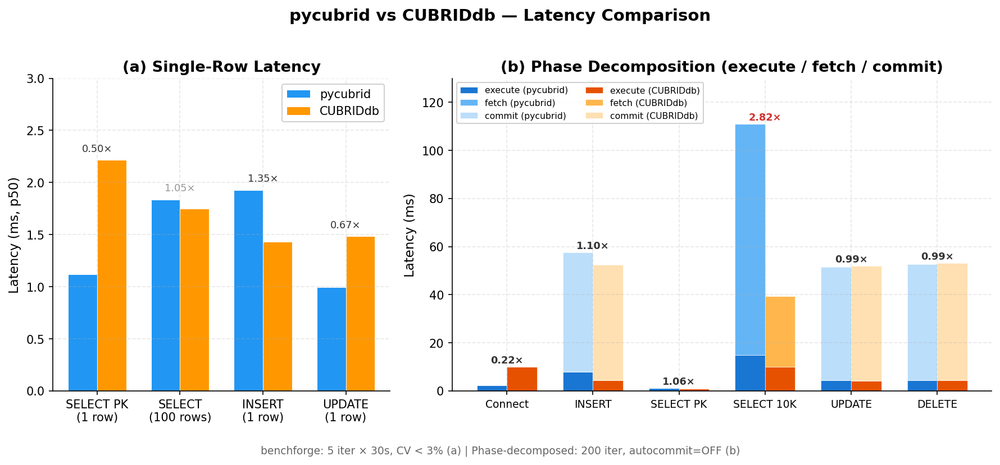
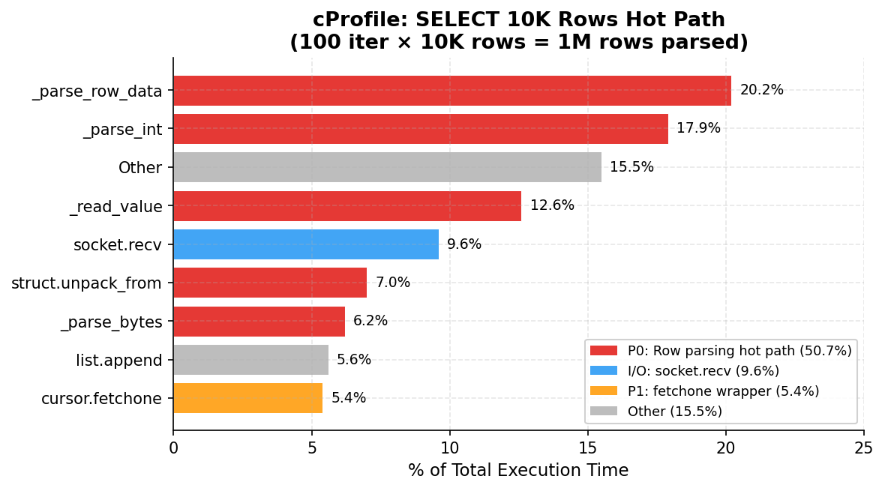

# CUBRID Benchmark Suite

<!-- BADGES:START -->


[](https://github.com/cubrid-labs/cubrid-benchmark)
<!-- BADGES:END -->

Multi-language benchmark suite for CUBRID 11.2 vs MySQL 8.0 across Python, TypeScript, and Go.
The current primary study is **pycubrid vs CUBRIDdb** — measuring and closing the performance gap
between a pure-Python driver and the legacy C extension driver for CUBRID.

## Summary: pycubrid vs CUBRIDdb

> Same database, same protocol, different driver implementation.



| Scenario | pycubrid | CUBRIDdb | Ratio | Source |
|----------|:---:|:---:|:---:|---|
| Connect | 2.24 ms | 10.01 ms | 0.22× | [Phase-decomposed](DRIVER_COMPARISON.md#connect) |
| SELECT PK (1 row) | 1.12 ms | 2.22 ms | 0.50× | [Benchforge](DRIVER_COMPARISON.md#benchforge-validated-results-statistical) |
| UPDATE (1 row) | 1.00 ms | 1.48 ms | 0.67× | [Benchforge](DRIVER_COMPARISON.md#benchforge-validated-results-statistical) |
| INSERT (1 row) | 1.93 ms | 1.43 ms | 1.35× | [Benchforge](DRIVER_COMPARISON.md#benchforge-validated-results-statistical) |
| SELECT (100 rows) | 1.84 ms | 1.75 ms | 1.05× | [Benchforge](DRIVER_COMPARISON.md#benchforge-validated-results-statistical) |
| **SELECT (10K rows)** | **110.94 ms** | **39.36 ms** | **2.82×** | [Phase-decomposed](DRIVER_COMPARISON.md#select-full-scan-10000-rows) |

pycubrid is faster or at parity for all operations except **bulk row fetch (10K+ rows)**,
where Python-side row parsing is 2.82× slower. This is the sole optimization target.



The top three functions in the fetch path — `_parse_row_data`, `_parse_int`, `_read_value` —
account for 50.7% of total execution time. The bottleneck is CPU-bound, not I/O-bound.
See [DRIVER_COMPARISON.md](DRIVER_COMPARISON.md) for full profiling data and optimization plan.

## Experiment Reports

| Report | Description |
|---|---|
| [DRIVER_COMPARISON.md](DRIVER_COMPARISON.md) | pycubrid vs CUBRIDdb — phase decomposition, profiling, optimization targets |
| [BENCHFORGE_RESULTS.md](BENCHFORGE_RESULTS.md) | pycubrid vs PyMySQL (cross-database) — benchforge statistical validation |
| [BASELINE.md](BASELINE.md) | Multi-language baseline (Python, TypeScript, Go) — initial reference point |

## Quick Start

```bash
make up        # Start CUBRID + MySQL Docker containers
make seed      # Apply schema
make all       # Run all benchmarks
```

## Drivers Tested

| Language | CUBRID Driver | MySQL Driver |
|----------|--------------|--------------|
| Python | [pycubrid](https://github.com/cubrid-labs/pycubrid) v0.5.0 | PyMySQL |
| Python | [CUBRIDdb](https://github.com/cubrid/cubrid-python) v9.3.0.1 (C ext) | — |
| TypeScript | [cubrid-client](https://github.com/cubrid-labs/cubrid-client) v1.1.0 | mysql2 |
| Go | [cubrid-go](https://github.com/cubrid-labs/cubrid-go) v0.2.1 | go-sql-driver/mysql |

## Tier Model

| Tier | Description | Status |
|------|-------------|--------|
| 0 | Functional smoke (connect + CRUD) | ✅ |
| 1 | Driver throughput (sequential ops) | ✅ |
| 2 | ORM overhead vs raw driver | Planned |
| 3/4 | Concurrency and soak stability | Planned |

## Links

- [Roadmap](ROADMAP.md)
- [Methodology](docs/METHODOLOGY.md)
- [Project Board](https://github.com/orgs/cubrid-labs/projects/2)
- [CUBRID Ecosystem](https://github.com/cubrid-labs)

## License

MIT
