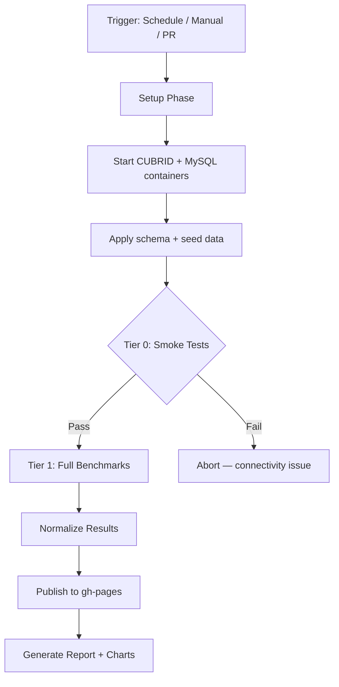
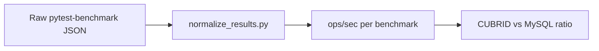
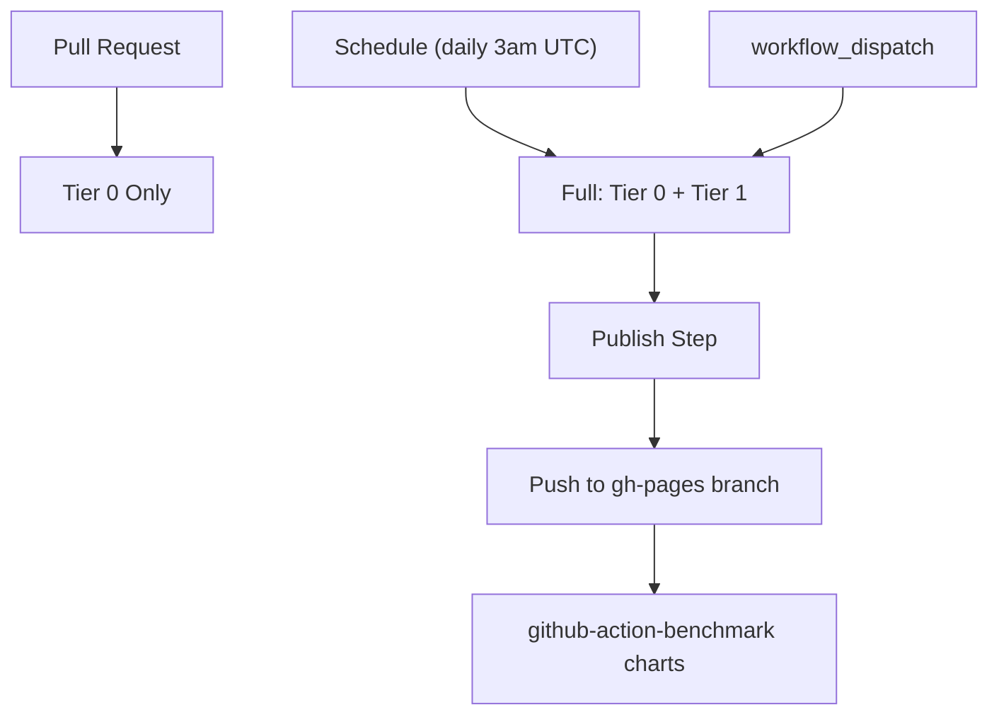

# Benchmark Methodology

How the CUBRID Benchmark suite measures and compares database performance.

## Overview



## Tier Structure

### Tier 0 — Smoke Tests

**Purpose**: Verify database connectivity and basic operation before running expensive benchmarks.

**What it tests**:
- TCP connectivity to both CUBRID (port 33000) and MySQL (port 3306)
- Basic `INSERT` / `SELECT` / `UPDATE` / `DELETE` operations
- Schema compatibility

**Languages**: Python, TypeScript, Go

**Runtime**: ~30 seconds

**When it runs**: Every PR and every nightly run.

### Tier 1 — Full Benchmarks

**Purpose**: Measure real performance characteristics under controlled conditions.

**What it tests**:
- Bulk `INSERT` throughput
- Primary key `SELECT` latency
- Range `SELECT` with filtering
- `UPDATE` throughput
- Mixed read/write workloads

**Languages**: Python, TypeScript, Go

**Runtime**: ~10-15 minutes

**When it runs**: Nightly schedule and manual `workflow_dispatch` only (not on PRs).

## Database Setup

Both databases run as Docker containers on the CI runner:

| Database | Image | Port | Credentials |
|----------|-------|------|-------------|
| CUBRID | `cubrid/cubrid:11.2` | 33000 | `dba` (no password) |
| MySQL | `mysql:8.0` | 3306 | `root` / `bench` |

Both use the same database name (`benchdb`) and identical schema, ensuring a fair comparison.

### Schema

The benchmark schema is applied via `scripts/apply_schema.py`:
- Creates identical tables in both databases
- Seeds with the same initial data
- Ensures indexes match between CUBRID and MySQL

## Metrics

### Primary Metric: ops/sec

All results are normalized to **operations per second** for consistent comparison.



### Conversion Logic

From `pytest-benchmark` output:
1. If `stats.ops` is available → use directly
2. If only `stats.mean` is available → compute `1 / mean`
3. Include `stddev` as `+/- X%` range

### Result Format

Normalized results follow the `github-action-benchmark` schema:
```json
{
    "name": "bench_insert_bulk",
    "unit": "ops/sec",
    "value": 95.4321,
    "range": "+/- 3.2%",
    "extra": "language=python tier=1 framework=pytest-benchmark"
}
```

## Language-Specific Drivers

| Language | CUBRID Driver | MySQL Driver | Benchmark Framework |
|----------|--------------|--------------|---------------------|
| Python | pycubrid + sqlalchemy-cubrid | PyMySQL + SQLAlchemy | pytest-benchmark |
| TypeScript | cubrid-client | mysql2 | Custom timer |
| Go | cubrid-go | go-sql-driver/mysql | `testing.B` |

## Known Performance Characteristics

Based on benchmark results:

| Language | CUBRID vs MySQL | Notes |
|----------|----------------|-------|
| Python | ~4-6× slower | pycubrid is pure Python; PyMySQL has C extensions |
| TypeScript | ~0.4-0.5× (CUBRID faster) | cubrid-client uses efficient binary protocol |
| Go | ~1:1 (near parity) | Both drivers use native implementations |

## Normalization

The `scripts/normalize_results.py` script converts raw `pytest-benchmark` JSON output into the standardized format consumed by `github-action-benchmark`.

### Process

1. Read raw JSON from `pytest-benchmark` output
2. Extract `stats.ops` or compute from `stats.mean`
3. Calculate `stddev` as percentage of mean
4. Tag with language, tier, and framework metadata
5. Output standardized JSON

## CI Integration

### Workflow: `bench.yml`



**PR runs**: Tier 0 only (quick validation, ~30s)

**Nightly runs**: Full suite (Tier 0 → Tier 1 → Normalize → Publish)

### Benchmark Tracking

Results are published to the `gh-pages` branch using [`github-action-benchmark`](https://github.com/benchmark-action/github-action-benchmark):
- Historical data stored in `dev/bench/` directory
- Alert threshold: 110% (warns if performance degrades by >10%)
- Charts auto-generated from historical data
- Comments posted on PRs when alerts trigger

## Running Locally

```bash
# Start databases
make up

# Run smoke tests
make tier0
make tier0-ts
make tier0-go

# Run full benchmarks
make tier1-python
make tier1-ts
make tier1-go

# Normalize results
python3 scripts/normalize_results.py results/python_tier1.json

# Cleanup
make clean
```

## Extending Benchmarks

### Adding a new workload

1. Add the benchmark function to the appropriate language directory
2. Follow naming convention: `bench_{operation}_{variant}`
3. Ensure both CUBRID and MySQL variants exist for fair comparison
4. Update the Makefile targets if needed

### Adding a new language

1. Create a new directory under the repo root
2. Implement Tier 0 (connectivity) and Tier 1 (performance) benchmarks
3. Add Makefile targets: `tier0-{lang}`, `tier1-{lang}`
4. Update `bench.yml` workflow to include the new language
