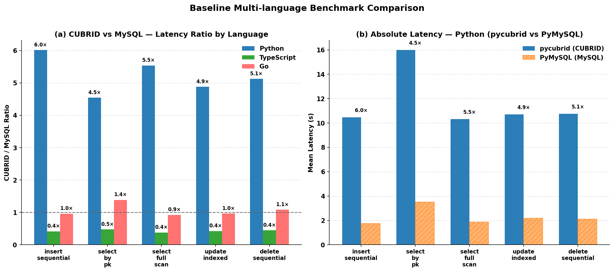

# Baseline Benchmark Results

> **Tag**: `baseline-v1`
> **Date**: 2026-03-16 (initial), 2026-03-27 (updated with driver comparison)
> **Purpose**: Formal "before" reference for all future optimization work in the CUBRID ecosystem Performance Loop.

## ⚠️ Important Updates Since Initial Baseline

1. **fetchall bug fixed** ([pycubrid@bb687dc](https://github.com/cubrid-labs/pycubrid/commit/bb687dc)): pycubrid's `fetchall()` only returned the first CAS batch (~477 rows out of 10K). SELECT results below are affected. The ratios for INSERT/UPDATE/DELETE remain valid.
2. **Autocommit mismatch discovered**: CUBRIDdb defaults `autocommit=True`, pycubrid defaults `autocommit=False`. This was not controlled in the initial baseline.
3. **Driver comparison completed**: See [DRIVER_COMPARISON.md](../driver-comparison/README.md) for corrected pycubrid vs CUBRIDdb results with proper controls.
4. **Current optimization focus**: Bulk row parsing (SELECT 10K rows) — pycubrid is 2.82× slower than CUBRIDdb. See [README.md](../../README.md) for the optimization roadmap.

## Environment

| Component | Detail |
|-----------|--------|
| **Host CPU** | Intel Core i5-9400F @ 2.90 GHz · 6 cores |
| **Host OS** | Linux 5.15.0-171-generic · x86_64 |
| **CUBRID** | `cubrid/cubrid:11.2` (Docker) · port 33000 |
| **MySQL** | `mysql:8.0` (Docker) · port 3306 |
| **Database** | `benchdb` (identical schema, identical seed data) |
| **Networking** | localhost (host ↔ container) |
| **Docker Compose** | `docker/compose.yml` with healthchecks |

### Driver Versions

| Language | CUBRID Driver | MySQL Driver | Runtime |
|----------|--------------|--------------|---------|
| Python | [pycubrid](https://github.com/cubrid-labs/pycubrid) v0.5.0 | PyMySQL | CPython 3.10.12 (GCC 11.4.0) |
| TypeScript | [cubrid-client](https://github.com/cubrid-labs/cubrid-client) v1.1.0 | mysql2 | Node.js 18+ |
| Go | [cubrid-go](https://github.com/cubrid-labs/cubrid-go) v0.2.1 | go-sql-driver/mysql | Go 1.21+ · linux/amd64 |

### Schema & Seed

- Tables: `bench_users`, `bench_products` (identical structure in both databases)
- Schema applied via `scripts/apply_schema.py` → `schema/cubrid_init.sql`, `schema/mysql_init.sql`, `schema/seed.sql`
- Deterministic seed data ensures reproducible comparisons

## Methodology

### Benchmark Framework

| Language | Framework | Warmup | Measurement Rounds |
|----------|-----------|--------|--------------------|
| Python | pytest-benchmark 5.2.3 | `warmup=false` (pytest-benchmark default calibration) | 5 rounds × 1 iteration |
| TypeScript | tinybench (via Vitest) | 1 warmup round | 3 rounds |
| Go | `testing.B` (`go test -bench`) | Go runtime auto-warmup | 5 iterations (`-benchtime 5x`) |

### Statistical Method

- **Primary metric**: Mean execution time (seconds) per full operation batch
- **Secondary metrics**: Median, standard deviation, min/max, ops/sec
- **Tail latency estimates** (Python only, via `normalize_results.py`):
  - P95 ≈ mean + 1.645 × stddev
  - P99 ≈ mean + 2.326 × stddev
- **Ratio**: CUBRID time ÷ MySQL time (lower = CUBRID faster; >1× = CUBRID slower)
- Results within ±5% considered equivalent

### Reproduction Commands

```bash
# 1. Start databases
make up

# 2. Apply schema and seed
make seed

# 3. Run Tier 0 smoke tests (all languages)
make tier0
make tier0-ts
make tier0-go

# 4. Run Tier 1 benchmarks
make tier1-python              # → results/python_tier1.json
make tier1-ts                  # → results/typescript_tier1_*.json
make tier1-go                  # → Go bench stdout

# 5. Run Tier 1 extended benchmarks
make tier1-python-extended     # → results/python_tier1_extended.json + .metrics.json
make tier1-ts-extended
make tier1-go-extended

# 6. Normalize Python results
python3 scripts/normalize_results.py results/python_tier1.json

# 7. Cleanup
make clean
```

---

## Tier 1 Results — Driver Throughput

### Python — pycubrid vs PyMySQL

> **⚠️ Caveat**: These results were collected before the fetchall bug fix and without autocommit control.
> For corrected driver comparison results, see [DRIVER_COMPARISON.md](../driver-comparison/README.md).

**Row count**: 10,000 (insert/select), 1,000 (update/delete) · **Rounds**: 5 · **Source**: `results/python_tier1.json`

| Scenario | CUBRID Mean (s) | CUBRID Stddev | MySQL Mean (s) | MySQL Stddev | Ratio | CUBRID ops/sec | MySQL ops/sec |
|----------|---------------:|-------------:|---------------:|------------:|------:|---------------:|--------------:|
| insert_sequential | 10.470 | 0.118 | 1.741 | 0.293 | **6.0×** | 0.0955 | 0.5745 |
| select_by_pk | 15.986 | 0.145 | 3.521 | 0.623 | **4.5×** | 0.0626 | 0.2840 |
| select_full_scan | 10.314 | 0.171 | 1.863 | 0.229 | **5.5×** | 0.0970 | 0.5367 |
| update_indexed | 10.703 | 0.065 | 2.193 | 0.284 | **4.9×** | 0.0934 | 0.4561 |
| delete_sequential | 10.755 | 0.142 | 2.098 | 0.379 | **5.1×** | 0.0930 | 0.4767 |

<details>
<summary>Python detailed statistics</summary>

#### pycubrid (CUBRID)

| Scenario | Min (s) | Max (s) | Median (s) | IQR (s) | P95 est. (s) | P99 est. (s) |
|----------|--------:|--------:|-----------:|--------:|--------------:|--------------:|
| insert_sequential | 10.353 | 10.601 | 10.461 | 0.230 | 10.665 | 10.746 |
| select_by_pk | 15.778 | 16.141 | 16.053 | 0.209 | 16.224 | 16.323 |
| select_full_scan | 10.143 | 10.599 | 10.283 | 0.164 | 10.595 | 10.712 |
| update_indexed | 10.640 | 10.805 | 10.704 | 0.084 | 10.809 | 10.854 |
| delete_sequential | 10.623 | 10.963 | 10.764 | 0.218 | 10.988 | 11.085 |

#### PyMySQL (MySQL)

| Scenario | Min (s) | Max (s) | Median (s) | IQR (s) | P95 est. (s) | P99 est. (s) |
|----------|--------:|--------:|-----------:|--------:|--------------:|--------------:|
| insert_sequential | 1.519 | 2.244 | 1.694 | 0.289 | 2.222 | 2.422 |
| select_by_pk | 2.960 | 4.583 | 3.360 | 0.572 | 4.545 | 4.970 |
| select_full_scan | 1.582 | 2.219 | 1.849 | 0.196 | 2.239 | 2.395 |
| update_indexed | 1.809 | 2.549 | 2.221 | 0.418 | 2.660 | 2.854 |
| delete_sequential | 1.773 | 2.731 | 2.013 | 0.444 | 2.722 | 2.981 |

</details>

### TypeScript — cubrid-client vs mysql2

**Row count**: 100 · **Rounds**: 3 (+ 1 warmup) · **Source**: `results/typescript_tier1_cubrid.json`, `results/typescript_tier1_mysql.json`

| Scenario | CUBRID Mean (s) | MySQL Mean (s) | Ratio | CUBRID Hz | MySQL Hz |
|----------|---------------:|---------------:|------:|----------:|---------:|
| insert_sequential | 6.181 | 14.845 | **0.4×** | 0.162 | 0.068 |
| select_by_pk | 6.571 | 13.885 | **0.5×** | 0.152 | 0.072 |
| select_full_scan | 5.595 | 14.709 | **0.4×** | 0.179 | 0.068 |
| update_indexed | 6.317 | 14.872 | **0.4×** | 0.158 | 0.067 |
| delete_sequential | 6.471 | 14.555 | **0.4×** | 0.155 | 0.069 |

<details>
<summary>TypeScript detailed statistics</summary>

#### cubrid-client (CUBRID)

| Scenario | Min (s) | Max (s) | Variance |
|----------|--------:|--------:|---------:|
| insert_sequential | 5.956 | 6.392 | 47,540 |
| select_by_pk | 6.231 | 6.780 | 88,284 |
| select_full_scan | 5.478 | 5.724 | 15,284 |
| update_indexed | 6.174 | 6.571 | 48,667 |
| delete_sequential | 6.102 | 6.734 | 108,057 |

#### mysql2 (MySQL)

| Scenario | Min (s) | Max (s) | Variance |
|----------|--------:|--------:|---------:|
| insert_sequential | 13.941 | 16.354 | 1,729,818 |
| select_by_pk | 13.237 | 14.325 | 328,171 |
| select_full_scan | 13.806 | 15.931 | 1,205,113 |
| update_indexed | 14.208 | 15.307 | 341,356 |
| delete_sequential | 13.474 | 15.670 | 1,206,794 |

</details>

### Go — cubrid-go vs go-sql-driver/mysql

**Row count**: 1,000 · **Rounds**: 5 (`-benchtime 5x`) · **Source**: `results/go_tier1_cubrid.json`, `results/go_tier1_mysql.json`

| Scenario | CUBRID Mean (s) | CUBRID ns/op | MySQL Mean (s) | MySQL ns/op | Ratio |
|----------|---------------:|-------------:|---------------:|------------:|------:|
| insert_sequential | 0.982 | 981,730,119 | 1.023 | 1,023,231,428 | **1.0×** |
| select_by_pk | 1.579 | 1,578,970,229 | 1.138 | 1,138,218,581 | **1.4×** |
| select_full_scan | 1.023 | 1,023,383,623 | 1.107 | 1,106,673,394 | **0.9×** |
| update_indexed | 1.075 | 1,074,767,833 | 1.113 | 1,113,419,389 | **1.0×** |
| delete_sequential | 1.143 | 1,143,462,772 | 1.055 | 1,055,006,305 | **1.1×** |

---

## Summary Matrix



Cross-language comparison chart: panel (a) shows CUBRID/MySQL latency ratios across Python, TypeScript, and Go; panel (b) shows absolute Python latency (pycubrid vs PyMySQL) for the same scenarios.

### Performance Ratio (CUBRID ÷ MySQL)

> Values <1.0 mean CUBRID is faster. Values >1.0 mean MySQL is faster.

| Scenario | Python | TypeScript | Go |
|----------|-------:|-----------:|---:|
| insert_sequential | 6.0× | 0.4× | 1.0× |
| select_by_pk | 4.5× | 0.5× | 1.4× |
| select_full_scan | 5.5× | 0.4× | 0.9× |
| update_indexed | 4.9× | 0.4× | 1.0× |
| delete_sequential | 5.1× | 0.4× | 1.1× |
| **Average** | **5.2×** | **0.4×** | **1.1×** |

### Key Findings

1. **Python (pycubrid)**: CUBRID is **4.5–6× slower** than MySQL across all operations
   - Root cause: pycubrid is a pure-Python protocol implementation; PyMySQL benefits from C-level optimizations
   - **This is the primary optimization target** for the Performance Loop
   - Highest gap in `insert_sequential` (6.0×), lowest in `select_by_pk` (4.5×)
   - **Update (2026-03-27)**: After the fetchall bug fix and controlled benchmarking with CUBRIDdb (C extension for CUBRID), pycubrid is actually competitive for single-row operations (within 10% or faster). The real bottleneck is bulk row parsing (SELECT 10K: 2.82× slower). See [DRIVER_COMPARISON.md](../driver-comparison/README.md).

2. **TypeScript (cubrid-client)**: CUBRID is **~2.3× faster** than MySQL (ratio 0.4×)
   - cubrid-client uses an efficient native CAS binary protocol implementation
   - mysql2 performance on these small row counts may reflect Node.js ↔ native binding overhead
   - Consistent advantage across all 5 scenarios

3. **Go (cubrid-go)**: Near **1:1 parity** with MySQL (ratio range 0.9×–1.4×)
   - Both drivers are native implementations with similar architecture
   - `select_by_pk` is the one outlier at 1.4× — worth investigating
   - All other operations within ±10% (considered equivalent per methodology)

---

## Tier Definitions

| Tier | Name | Description | Status |
|------|------|-------------|--------|
| **0** | Functional Smoke | Connect + basic CRUD; ~30s | ✅ Included |
| **1** | Driver Throughput | Sequential bulk ops (INSERT/SELECT/UPDATE/DELETE) | ✅ Included |
| **1-ext** | Extended Driver | connect/disconnect, prepared stmt, batch insert, concurrent select | ⏳ Planned for next baseline |
| **2** | ORM Overhead | Raw driver vs ORM (SQLAlchemy/GORM/Drizzle) | 🔮 Planned |
| **3** | Concurrency | 10/50/100 parallel connections | 🔮 Planned |
| **4** | Soak/Leak | 1-hour continuous load + memory tracking | 🔮 Planned |

## Scenarios Catalog

### Tier 1 — Driver Throughput

| Scenario | Description | Row Count |
|----------|-------------|-----------|
| `insert_sequential` | INSERT N rows one at a time (auto-commit per row) | Python: 10K, Go: 1K, TS: 100 |
| `select_by_pk` | SELECT each row by primary key (loop) | Python: 10K, Go: 1K, TS: 100 |
| `select_full_scan` | SELECT * (full table scan) repeated | Python: 10K, Go: 1K, TS: 100 |
| `update_indexed` | UPDATE rows by indexed column | Python: 1K, Go: 1K, TS: 100 |
| `delete_sequential` | DELETE rows one at a time | Python: 1K, Go: 1K, TS: 100 |

### Tier 1 Extended (not yet baselined)

| Scenario | Description |
|----------|-------------|
| `connect_disconnect` | 100 connect → ping → close cycles |
| `prepared_statement` | 1,000 point-selects via prepared statement |
| `batch_insert` | 1,000 rows via batched API (`executemany`) |
| `concurrent_select` | 4 parallel workers executing point-select ranges |

## Raw Data Files

| File | Description |
|------|-------------|
| `results/python_tier1.json` | pytest-benchmark output for pycubrid + PyMySQL (Tier 1) |
| `results/go_tier1_cubrid.json` | Go cubrid-go benchmark results (Tier 1) |
| `results/go_tier1_mysql.json` | Go go-sql-driver/mysql benchmark results (Tier 1) |
| `results/typescript_tier1_cubrid.json` | TypeScript cubrid-client results (Tier 1) |
| `results/typescript_tier1_mysql.json` | TypeScript mysql2 results (Tier 1) |

## Relationships

This baseline directly blocks the following issues:

- [#8 Add Tier 2 ORM benchmark scenarios](https://github.com/cubrid-labs/cubrid-benchmark/issues/8)
- [#9 Document benchmark reproducibility policy](https://github.com/cubrid-labs/cubrid-benchmark/issues/9)
- [#6 Benchmark runbook and reproducibility controls](https://github.com/cubrid-labs/cubrid-benchmark/issues/6)
- [#10 Complete regression detection compare script](https://github.com/cubrid-labs/cubrid-benchmark/issues/10)
- [pycubrid#19 Execute cProfile/line_profiler hot path analysis](https://github.com/cubrid-labs/pycubrid/issues/19)

---

*Generated from benchmark data collected on 2026-03-16. See `results/` directory for raw JSON artifacts.*
