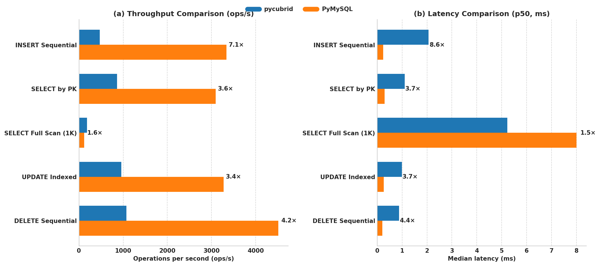

# BenchForge Results: pycubrid (CUBRID 11.2) vs PyMySQL (MySQL 8.0)

> **Note**: This document compares pycubrid against PyMySQL (cross-database). For the
> current optimization focus (pycubrid vs CUBRIDdb, same-database driver comparison),
> see [DRIVER_COMPARISON.md](../driver-comparison/README.md) and [README.md](../../README.md).

**Generated**: 2026-03-27  
**Platform**: BenchForge v0.1.0 (research-grade, HDR histogram-based measurement)  
**Methodology**: 5 iterations × 30s duration × 3s warmup, concurrency=1, seed=42

## Environment

| Parameter | Value |
|---|---|
| Host | devbox |
| OS | Linux 5.15.0-173-generic |
| CPU | Intel Core i5-4200M @ 2.50GHz (4 cores) |
| RAM | 15.3 GB |
| Python | 3.12.8 |
| pycubrid | 0.5.0 |
| PyMySQL | 1.1.2 |
| CUBRID | 11.2 (Docker) |
| MySQL | 8.0 (Docker) |

## Summary

| Scenario | pycubrid ops/s | PyMySQL ops/s | Ratio | Faster | p50 cubrid | p50 mysql |
|---|---:|---:|---:|---|---:|---:|
| INSERT Sequential | 470.7 | 3,334.7 | 7.1× | PyMySQL | 2.066 ms | 0.241 ms |
| SELECT by PK | 864.3 | 3,093.1 | 3.6× | PyMySQL | 1.104 ms | 0.297 ms |
| SELECT Full Scan (1K rows) | 183.6 | 117.0 | 0.6× | pycubrid | 5.225 ms | 8.003 ms |
| UPDATE Indexed | 955.1 | 3,271.9 | 3.4× | PyMySQL | 0.993 ms | 0.266 ms |
| DELETE Sequential | 1,073.0 | 4,507.0 | 4.2× | PyMySQL | 0.880 ms | 0.202 ms |

> **Ratio** = PyMySQL ops/s ÷ pycubrid ops/s. Values > 1 mean PyMySQL is faster.



*Figure: Two-panel benchmark comparison of throughput (ops/s) and median latency (p50, ms) for pycubrid vs PyMySQL across five scenarios.*

## Key Findings

1. **pycubrid has 3.4×–7.1× higher latency on single-row operations** — INSERT, SELECT by PK, UPDATE, and DELETE all show pycubrid at ~1–2 ms p50 vs PyMySQL at ~0.2–0.3 ms p50. This is a **driver-level overhead**, not just a database-level difference.

2. **pycubrid is faster on bulk reads (full table scan)** — When fetching 1,000 rows, pycubrid (CUBRID) is 1.6× faster than PyMySQL (MySQL). CUBRID returns large result sets more efficiently through the pycubrid driver.

3. **Extremely low variance across iterations** — All scenarios show CoV < 1.5%, confirming reproducible, stable measurements. The benchforge platform's warmup phase and seed-based determinism work effectively.

4. **DELETE is the fastest operation for both drivers** — pycubrid DELETE (1,073 ops/s) outperforms pycubrid INSERT (471 ops/s) by 2.3×, suggesting INSERT overhead is particularly high in the pycubrid driver.

## Detailed Results

### 1. INSERT Sequential

Single-row INSERT with auto-generated values (1,000 pre-seeded rows, sequential inserts).

| Metric | pycubrid | PyMySQL |
|---|---:|---:|
| **Throughput (avg)** | 470.7 ops/s | 3,334.7 ops/s |
| **Throughput StdDev** | ±1.5 | ±31.1 |
| **CoV** | 0.33% | 0.93% |
| **p50 latency** | 2.066 ms | 0.241 ms |
| **p95 latency** | 2.576 ms | 0.337 ms |
| **p99 latency** | 2.919 ms | 0.540 ms |
| **Total ops (per iter)** | ~14,121 | ~100,045 |

<details>
<summary>Per-iteration breakdown</summary>

| Iter | pycubrid ops/s | PyMySQL ops/s |
|---|---:|---:|
| 0 | 471.8 | 3,306.2 |
| 1 | 469.1 | 3,363.7 |
| 2 | 469.0 | 3,340.0 |
| 3 | 472.2 | 3,364.7 |
| 4 | 471.3 | 3,298.9 |

</details>

### 2. SELECT by Primary Key

Random PK lookup from 1,000 pre-seeded rows.

| Metric | pycubrid | PyMySQL |
|---|---:|---:|
| **Throughput (avg)** | 864.3 ops/s | 3,093.1 ops/s |
| **Throughput StdDev** | ±1.6 | ±6.1 |
| **CoV** | 0.18% | 0.20% |
| **p50 latency** | 1.104 ms | 0.297 ms |
| **p95 latency** | 1.462 ms | 0.400 ms |
| **p99 latency** | 1.724 ms | 0.541 ms |
| **Total ops (per iter)** | ~25,929 | ~92,798 |

<details>
<summary>Per-iteration breakdown</summary>

| Iter | pycubrid ops/s | PyMySQL ops/s |
|---|---:|---:|
| 0 | 866.4 | 3,082.7 |
| 1 | 862.1 | 3,098.4 |
| 2 | 863.6 | 3,095.3 |
| 3 | 864.1 | 3,096.3 |
| 4 | 865.1 | 3,093.0 |

</details>

### 3. SELECT Full Table Scan (1,000 rows)

Fetch all 1,000 rows from the benchmark table.

| Metric | pycubrid | PyMySQL |
|---|---:|---:|
| **Throughput (avg)** | 183.6 ops/s | 117.0 ops/s |
| **Throughput StdDev** | ±0.8 | ±0.6 |
| **CoV** | 0.43% | 0.48% |
| **p50 latency** | 5.225 ms | 8.003 ms |
| **p95 latency** | 6.917 ms | 11.274 ms |
| **p99 latency** | 7.886 ms | 12.408 ms |
| **Total ops (per iter)** | ~5,508 | ~3,510 |

<details>
<summary>Per-iteration breakdown</summary>

| Iter | pycubrid ops/s | PyMySQL ops/s |
|---|---:|---:|
| 0 | 184.5 | 117.5 |
| 1 | 183.6 | 117.3 |
| 2 | 184.2 | 116.7 |
| 3 | 183.1 | 117.3 |
| 4 | 182.6 | 116.2 |

</details>

### 4. UPDATE Indexed

Random PK-based UPDATE on 1,000 pre-seeded rows.

| Metric | pycubrid | PyMySQL |
|---|---:|---:|
| **Throughput (avg)** | 955.1 ops/s | 3,271.9 ops/s |
| **Throughput StdDev** | ±2.2 | ±43.7 |
| **CoV** | 0.23% | 1.34% |
| **p50 latency** | 0.993 ms | 0.266 ms |
| **p95 latency** | 1.325 ms | 0.370 ms |
| **p99 latency** | 1.605 ms | 0.558 ms |
| **Total ops (per iter)** | ~28,654 | ~98,160 |

<details>
<summary>Per-iteration breakdown</summary>

| Iter | pycubrid ops/s | PyMySQL ops/s |
|---|---:|---:|
| 0 | 954.5 | 3,322.2 |
| 1 | 951.6 | 3,233.9 |
| 2 | 957.5 | 3,316.8 |
| 3 | 956.4 | 3,240.7 |
| 4 | 955.4 | 3,245.8 |

</details>

### 5. DELETE Sequential

Delete by PK from 1,000 pre-seeded rows (re-seeded each iteration).

| Metric | pycubrid | PyMySQL |
|---|---:|---:|
| **Throughput (avg)** | 1,073.0 ops/s | 4,507.0 ops/s |
| **Throughput StdDev** | ±2.3 | ±19.6 |
| **CoV** | 0.22% | 0.43% |
| **p50 latency** | 0.880 ms | 0.202 ms |
| **p95 latency** | 1.195 ms | 0.260 ms |
| **p99 latency** | 1.476 ms | 0.394 ms |
| **Total ops (per iter)** | ~32,192 | ~135,215 |

<details>
<summary>Per-iteration breakdown</summary>

| Iter | pycubrid ops/s | PyMySQL ops/s |
|---|---:|---:|
| 0 | 1,072.8 | 4,499.4 |
| 1 | 1,074.7 | 4,522.9 |
| 2 | 1,074.6 | 4,521.1 |
| 3 | 1,074.0 | 4,476.1 |
| 4 | 1,069.1 | 4,515.6 |

</details>

## Statistical Quality

All scenarios demonstrate research-grade measurement stability:

| Scenario | pycubrid CoV | PyMySQL CoV |
|---|---:|---:|
| INSERT Sequential | 0.33% | 0.93% |
| SELECT by PK | 0.18% | 0.20% |
| SELECT Full Scan | 0.43% | 0.48% |
| UPDATE Indexed | 0.23% | 1.34% |
| DELETE Sequential | 0.22% | 0.43% |

> CoV (Coefficient of Variation) < 2% across all measurements indicates highly reproducible results. The benchforge warmup phase effectively eliminates JIT/caching noise.

## Analysis

### Driver Overhead Hypothesis

The consistent ~0.8–2.0 ms baseline latency for pycubrid across all single-row operations (vs ~0.2–0.3 ms for PyMySQL) suggests a **fixed per-query overhead in the pycubrid driver**, not a CUBRID server performance limitation. Evidence:

- **INSERT** (heaviest): pycubrid p50 = 2.066 ms, PyMySQL p50 = 0.241 ms → 1.8 ms gap
- **DELETE** (lightest): pycubrid p50 = 0.880 ms, PyMySQL p50 = 0.202 ms → 0.7 ms gap
- The gap is operation-dependent (1.8 ms for INSERT, 0.7 ms for DELETE), suggesting both driver overhead AND some server-side difference

### Full Table Scan Advantage

pycubrid's 1.6× advantage on full table scans (1,000 rows) likely stems from:
- CUBRID's row-fetching protocol may be more efficient for batch reads
- pycubrid's C extension may handle bulk data transfer better than PyMySQL's pure-Python approach
- The crossover point where pycubrid overtakes PyMySQL appears to be somewhere between 1 and 1,000 rows

### Next Steps

1. ~~**Connector-vs-connector comparison**: Run pycubrid vs CUBRIDdb against the same CUBRID instance~~ → **Done**: See [DRIVER_COMPARISON.md](../driver-comparison/README.md)
2. ~~**Profile pycubrid internals**: Use cProfile to identify where the per-query overhead originates~~ → **Done**: See profiling analysis in [DRIVER_COMPARISON.md](../driver-comparison/README.md)
3. **Optimize bulk row parsing**: Primary target — `_parse_row_data` → `_read_value` → `_parse_int` hot path
4. **Vary row counts**: Test SELECT with 10, 100, 1K, 10K rows to find the exact crossover point
5. **Connection pooling**: Test with concurrency > 1 to see if the driver overhead is amplified under contention

## Artifacts

- **HTML reports**: `results/benchforge/reports/*.html` (5 interactive reports with latency distributions)
- **Raw JSON**: `results/benchforge/*.json` (5 result files with full HDR histogram data)
- **Scenario files**: `scenarios/benchforge/cubrid_mysql_*.yaml` (5 benchmark definitions)

## Reproducibility

Requires [benchforge](https://github.com/yeongseon/benchforge) installed (`pip install -e ".[cubrid,mysql]"`).

```bash
# Start databases
docker compose -f docker/compose.yml up -d

# Run all 5 scenarios
for scenario in scenarios/benchforge/cubrid_mysql_*.yaml; do
    bench run "$scenario" -o "results/benchforge/$(basename ${scenario%.yaml}).json" --iterations 5
done

# Generate HTML reports
for result in results/benchforge/*.json; do
    bench report "$result"
done
```
