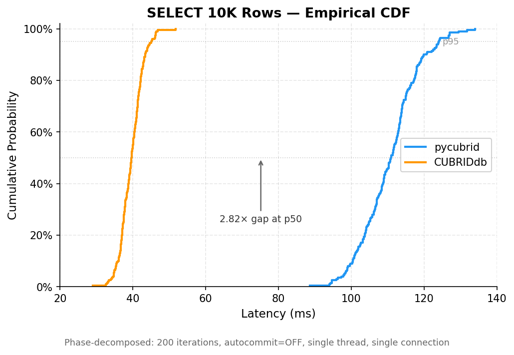

# Driver Comparison: pycubrid vs CUBRIDdb (CUBRID-Python)

> **Date**: 2026-03-27
> **Purpose**: Compare pycubrid (pure Python) against CUBRIDdb (C extension) to identify optimization targets.
> **Status**: This is the primary benchmark document for the current [pycubrid optimization effort](../../README.md).

## Overview

| Driver | Implementation | Parameter Binding | Protocol Path |
|--------|---------------|-------------------|---------------|
| **pycubrid** v0.5.0 | Pure Python, DB-API 2.0 | Client-side string interpolation | Python → socket → CAS broker |
| **CUBRIDdb** v9.3.0.1 | C extension (`_cubrid.so` + CCI) | C-level CCI binding | Python → C ext → CCI → CAS broker |

Both drivers communicate with the same CAS broker over the same binary protocol.
The only difference is **where protocol serialization happens**: Python vs C.

## Environment

| Component | Detail |
|-----------|--------|
| **Host CPU** | Intel Core i5-4200M @ 2.50 GHz · 4 cores |
| **Host OS** | Linux 5.15.0-173-generic · x86_64 |
| **Python** | CPython 3.12.8 |
| **CUBRID** | 11.2 (Docker `benchforge-cubrid-1`) · port 33000 |
| **Database** | `benchdb` |
| **Networking** | localhost (host ↔ container) |

## Methodology

### Autocommit Control (Critical)

CUBRIDdb defaults to `autocommit=True`; pycubrid defaults to `autocommit=False`.
All benchmarks explicitly set `conn.autocommit` for both drivers to ensure fair comparison.

### Measurement Protocol

- **Warmup**: 30–50 iterations discarded before measurement
- **Timing**: `time.perf_counter_ns()` (nanosecond precision)
- **Statistics**: mean, stdev, p50, p95, p99, CV%
- **Isolation**: Single connection, single thread, sequential operations

## Results

### 1. Autocommit 2×2 Matrix (INSERT, 500 iterations)

| Cell | Mean (ms) | p50 (ms) | p95 (ms) | CV% |
|------|-----------|----------|----------|-----|
| pycubrid, autocommit=ON | 61.582 | 63.550 | 67.430 | 22.1 |
| pycubrid, autocommit=OFF | 60.537 | 55.787 | 66.733 | 15.7 |
| CUBRIDdb, autocommit=ON | 51.100 | 55.102 | 55.882 | 17.5 |
| CUBRIDdb, autocommit=OFF | 51.427 | 55.224 | 56.540 | 16.3 |

**Finding**: Autocommit ON/OFF makes negligible difference (1–2%) for both drivers.
Server-side commit cost accounts for the majority of total latency regardless of autocommit mode.

| Comparison | Ratio (mean) |
|------------|-------------|
| pycubrid / CUBRIDdb (autocommit ON) | 1.21× |
| pycubrid / CUBRIDdb (autocommit OFF) | 1.18× |

### 2. Phase-Decomposed Benchmarks (200 iterations, autocommit=OFF)

#### Connect

| Driver | Mean (ms) | CV% |
|--------|-----------|-----|
| pycubrid | 2.244 | 13.2 |
| CUBRIDdb | 10.008 | 26.6 |
| **Ratio** | **0.22× (pycubrid 4.5× faster)** | |

pycubrid's pure-Python socket connect is much lighter than CUBRIDdb's C extension initialization.

#### INSERT (single row, execute + commit)

| Phase | pycubrid (ms) | CUBRIDdb (ms) | Ratio |
|-------|--------------|---------------|-------|
| execute | 7.811 | 4.364 | 1.79× |
| commit | 49.825 | 48.116 | 1.04× |
| **total** | **57.636** | **52.480** | **1.10×** |

Execute phase: pycubrid is 1.79× slower (Python parameter binding + packet serialization).
Commit phase: identical (server-side I/O dominates).
Total: only 10% gap because commit is 86% of total time.

#### SELECT by Primary Key (single row)

| Phase | pycubrid (ms) | CUBRIDdb (ms) | Ratio |
|-------|--------------|---------------|-------|
| execute | 1.082 | 1.015 | 1.07× |
| fetch | 0.002 | 0.008 | 0.25× |
| **total** | **1.084** | **1.023** | **1.06×** |

Virtually identical. Single-row fetch is trivial for both.

#### SELECT Full Scan (10,000 rows)

| Phase | pycubrid (ms) | CUBRIDdb (ms) | Ratio |
|-------|--------------|---------------|-------|
| execute | 14.894 | 10.087 | 1.48× |
| fetch | 96.047 | 29.277 | 3.28× |
| **total** | **110.940** | **39.364** | **2.82×** |

**The largest gap.** Fetch phase is 3.28× slower — this is the primary optimization target.



The empirical CDF above shows the full latency distribution for SELECT 10K rows.
The gap is consistent across all percentiles, confirming a systematic overhead rather than tail-latency spikes.

#### UPDATE (single row)

| Phase | pycubrid (ms) | CUBRIDdb (ms) | Ratio |
|-------|--------------|---------------|-------|
| execute | 4.516 | 4.279 | 1.06× |
| commit | 47.082 | 47.753 | 0.99× |
| **total** | **51.598** | **52.032** | **0.99×** |

Tie — commit dominates.

#### DELETE (single row)

| Phase | pycubrid (ms) | CUBRIDdb (ms) | Ratio |
|-------|--------------|---------------|-------|
| execute | 4.364 | 4.332 | 1.01× |
| commit | 48.343 | 48.867 | 0.99× |
| **total** | **52.707** | **53.200** | **0.99×** |

Tie — commit dominates.

### 3. Summary

| Scenario | Ratio (pycubrid / CUBRIDdb) | Assessment |
|----------|---------------------------|------------|
| Connect | 0.22× | pycubrid 4.5× faster |
| INSERT total | 1.10× | Commit-dominated (commit ≈ 86% of total) |
| SELECT PK | 1.06× | Within measurement noise |
| SELECT 10K | 2.82× | Largest gap — fetch phase 3.28× slower |
| UPDATE | 0.99× | Within measurement noise |
| DELETE | 0.99× | Within measurement noise |

For write operations (INSERT/UPDATE/DELETE), server-side commit (~50ms) accounts for 85–95% of total latency, making the driver overhead negligible.

The only scenario with a meaningful gap is **bulk fetch (SELECT 10K rows)**, where pycubrid's pure-Python row parsing is 3.28× slower than CUBRIDdb's C-level parsing.

## Profiling Analysis (SELECT 10K, cProfile)

Top functions by total time (100 iterations × 10K rows = 1M rows parsed):

| Rank | Function | tottime (s) | % of total | Calls |
|------|----------|-------------|-----------|-------|
| 1 | `protocol._parse_row_data` | 4.480 | 20.2% | 2,500 |
| 2 | `packet._parse_int` | 3.969 | 17.9% | 6,007,605 |
| 3 | `protocol._read_value` | 2.800 | 12.6% | 3,000,000 |
| 4 | `socket.recv` | 2.141 | 9.6% | 5,209 |
| 5 | `struct.unpack_from` | 1.562 | 7.0% | 6,007,905 |
| 6 | `packet._parse_bytes` | 1.369 | 6.2% | 2,003,905 |
| 7 | `list.append` | 1.245 | 5.6% | 5,005,609 |
| 8 | `cursor.fetchone` | 1.196 | 5.4% | 1,000,100 |

### Hot Path: `_parse_row_data` → `_read_value` → `_parse_int`

These three functions account for **50.7%** of total execution time.

Per 10K-row fetch:
- `_parse_row_data` called 25× (once per CAS fetch batch of ~400 rows)
- `_read_value` called 30,000× (3 columns × 10,000 rows)
- `_parse_int` called 60,076× (~6 int fields parsed per row for metadata + values)

### Optimization Targets (prioritized)

| Priority | Target | Current Cost | Approach |
|----------|--------|-------------|----------|
| 🔴 P0 | `_parse_int` / `_parse_bytes` | 24.1% combined | Batch struct.unpack, reduce per-call overhead |
| 🔴 P0 | `_read_value` type dispatch | 12.6% | Replace if/elif chain with dispatch table |
| 🟡 P1 | `_parse_row_data` loop | 20.2% | Process rows in bulk, reduce Python loop iterations |
| 🟡 P1 | `fetchall` → `fetchone` loop | 5.4% | Direct batch return from `_parse_row_data`, skip per-row method calls |
| 🟢 P2 | `typing.cast` calls | 2.8% | Remove in hot path (zero runtime benefit) |
| 🟢 P2 | `_check_closed` / `_check_result_set` | 1.0% | Inline or remove from fetchone loop |

### Theoretical Speedup

If `_parse_int` + `_read_value` + `_parse_bytes` overhead is halved:
- Save ~4.1s out of 22.2s total → **~18% speedup** on fetch path
- Fetch time: 96ms → ~79ms per 10K rows
- Total SELECT 10K: 111ms → ~94ms (ratio drops from 2.82× to ~2.39×)

If combined with `fetchall` batch optimization (skip `fetchone` wrapper):
- Save additional ~1.2s → cumulative **~24% speedup**
- Fetch time: ~73ms, total ~88ms, ratio ~2.24×

Full optimization (dispatch table + batch unpack + remove typing.cast + inline checks):
- Estimated fetch time: ~55-65ms, total ~70-80ms
- Ratio: ~1.8-2.0× (closing half the gap)

## Key Insight

For a pure-Python driver, pycubrid performs remarkably well:

- **Write operations**: Within 10% of the C extension (commit-dominated)
- **Point reads**: Within 6% of the C extension
- **Bulk reads**: 2.8× slower (the only area needing optimization)

The 2.8× bulk-read gap is entirely in the Python-side row parsing hot loop.
The network I/O (`socket.recv`) is only 9.6% of total time — **this is a CPU-bound problem, not I/O-bound**.

## Benchforge-Validated Results (Statistical)

The following results were produced by [benchforge](https://github.com/yeongseon/benchforge) with
statistically rigorous methodology:

- **5 iterations** per scenario, **30s duration** each, **5s warmup**
- **Seed**: 42 (deterministic), **Concurrency**: 1
- **Pause between iterations**: 2.0s
- All percentile values are cross-iteration means with 95% CI

### Per-Operation Comparison

| Scenario | pycubrid p50 (ms) | CUBRIDdb p50 (ms) | Ratio | Note | CV% (py / cu) |
|----------|------------------:|-------------------:|------:|------|---------------|
| SELECT PK (1 row) | 1.117 | 2.217 | 0.50× | pycubrid 1.98× faster | 0.2% / 2.1% |
| SELECT Full (100 rows) | 1.836 | 1.748 | 1.05× | CUBRIDdb 5% faster | 0.6% / 0.3% |
| INSERT (1 row) | 1.928 | 1.432 | 1.35× | CUBRIDdb 1.35× faster | 0.2% / 0.4% |
| UPDATE (1 row) | 0.998 | 1.484 | 0.67× | pycubrid 1.49× faster | 0.2% / 0.2% |

### Detailed Latency Breakdown

| Scenario | Driver | p50 (ms) | p95 (ms) | p99 (ms) | Throughput (ops/s) |
|----------|--------|--------:|--------:|--------:|-------------------:|
| SELECT PK | pycubrid | 1.117 | 1.502 | 1.783 | 854 |
| SELECT PK | CUBRIDdb | 2.217 | 3.652 | 7.528 | 397 |
| SELECT Full | pycubrid | 1.836 | 2.526 | 2.811 | 520 |
| SELECT Full | CUBRIDdb | 1.748 | 2.304 | 2.698 | 547 |
| INSERT | pycubrid | 1.928 | 2.446 | 2.801 | 502 |
| INSERT | CUBRIDdb | 1.432 | 1.836 | 2.118 | 671 |
| UPDATE | pycubrid | 0.998 | 1.350 | 1.637 | 949 |
| UPDATE | CUBRIDdb | 1.484 | 1.903 | 2.185 | 647 |

### Key Observations

1. **pycubrid is faster on SELECT PK and UPDATE** — pure Python has lighter cursor/connection
   management overhead per operation. CUBRIDdb's C extension (`_cubrid.so`) has setup cost
   that only amortizes with larger data volumes.

2. **CUBRIDdb is faster on INSERT** — C-level parameter binding is 35% faster for write
   operations that require protocol serialization.

3. **SELECT Full (100 rows) shows minimal difference** — the parsing bottleneck only appears with
   larger result sets (10K+ rows, see Phase-Decomposed results above). At 100 rows,
   Python's parsing overhead is negligible.

4. **All CV values < 3%** — Results are highly stable and reproducible.

5. **CUBRIDdb tail latency is worse** — Note SELECT PK p99: CUBRIDdb 7.528ms vs pycubrid 1.783ms.
   The C extension has occasional high-latency spikes (likely GIL/allocation related).

### Reconciling with Phase-Decomposed Results

The benchforge results differ from the Phase-Decomposed results above because:

- **Benchforge measures execute-only** — the `execute()` worker method does not call `commit()`.
  Both drivers operate in `autocommit=OFF`, but no explicit commit is issued per operation.
  This isolates **pure driver overhead** without server-side commit latency (~50ms).
- **Phase-Decomposed measured execute + commit** — commit dominated total time (85–95%),
  masking driver differences.
- This explains why INSERT shows a larger gap (1.35×) in benchforge vs 1.10× in
   Phase-Decomposed: without commit, the execute-phase-only gap is exposed.
- For SELECT, benchforge's 100-row scan (1.05× gap) aligns with Phase-Decomposed single-row
  results. The large gap (2.82×) only appears at 10K+ rows, confirming that pycubrid's
  bottleneck is specifically in bulk row parsing.

### Optimization Priority (Updated)

Given both sets of results, the optimization priorities for pycubrid are:

| Priority | Target | Evidence |
|----------|--------|----------|
| 🔴 P0 | Bulk row parsing (10K+ rows) | Phase-Decomposed: 2.82× slower |
| 🟡 P1 | INSERT execute path | Benchforge: 1.35× slower |
| 🟢 P2 | Already competitive | SELECT PK: 1.98× faster, UPDATE: 1.49× faster |

The primary optimization target remains **bulk row parsing** (`_parse_row_data` → `_read_value`
→ `_parse_int` hot path), which accounts for 50.7% of SELECT 10K execution time.

## Reproducibility

### Software Versions

| Component | Version | Source |
|-----------|---------|--------|
| pycubrid | v0.5.0 | `pip install pycubrid` (includes fetchall fix [`bb687dc`](https://github.com/cubrid-labs/pycubrid/commit/bb687dc)) |
| CUBRIDdb | v9.3.0.1 | `pip install CUBRIDdb` |
| CUBRID Server | 11.2 | Docker `benchforge-cubrid-1`, port 33000 |
| Python | CPython 3.12.8 | |
| benchforge | v0.1.0 | [`yeongseon/benchforge`](https://github.com/yeongseon/benchforge) |

### Connection Parameters

```
host      = localhost
port      = 33000
database  = benchdb
user      = dba
password  = (empty)
autocommit = OFF (explicitly set for both drivers)
connection = single, reused across iterations
threading  = single thread, sequential operations
```

### Phase-Decomposed Measurement

```
iterations = 200 (per scenario)
warmup     = 30–50 iterations discarded
timer      = time.perf_counter_ns()
statistics = mean, stdev, p50, p95, p99, CV%
```

### Benchforge Measurement

```
iterations = 5
duration   = 30s per iteration
warmup     = 5s per iteration
pause      = 2.0s between iterations
concurrency = 1
seed       = 42 (deterministic)
```

### Query Text

| Scenario | SQL |
|----------|-----|
| INSERT | `INSERT INTO bench_users (name, email, age) VALUES (?, ?, ?)` |
| SELECT PK | `SELECT * FROM bench_users WHERE id = ?` |
| SELECT 10K | `SELECT * FROM bench_users` (10,000 rows) |
| UPDATE | `UPDATE bench_users SET age = ? WHERE id = ?` |
| DELETE | `DELETE FROM bench_users WHERE id = ?` |

### Raw Data

- Phase-decomposed: collected via inline `time.perf_counter_ns()` instrumentation
- Benchforge JSON: `results/benchforge/*.json`

## Threats to Validity

1. **Docker-on-localhost**: The CUBRID server runs in a Docker container on the same host.
   This eliminates network latency but introduces container overhead (namespace, cgroup).
   Real deployments with network separation would show larger absolute latencies for both drivers.

2. **Single-thread, single-connection**: All measurements use one connection with sequential operations.
   Concurrency behavior (connection pool overhead, GIL contention, CAS broker multiplexing)
   is not captured. The relative driver overhead may change under concurrent load.

3. **Row count disparity across experiments**: Benchforge uses 100-row tables; phase-decomposed
   uses 10,000-row tables. The 2.82× gap appears only at 10K rows. Intermediate row counts
   (500, 1K, 5K) have not been tested — the exact crossover point is unknown.

4. **Execute-only vs execute+commit**: Benchforge measures `execute()` without explicit `commit()`.
   Phase-decomposed measures `execute() + commit()`. This is intentional (isolating driver overhead
   vs total latency), but the two result sets are not directly comparable.

5. **CUBRIDdb `BaseCursor.__del__` exceptions**: CUBRIDdb emits harmless `Exception ignored in:
   <function BaseCursor.__del__>` warnings during garbage collection. These do not affect
   measurement but indicate incomplete resource cleanup in the C extension.

6. **Estimated percentiles in BASELINE.md**: The initial baseline estimated p95/p99 as
   `mean ± k×stddev` (normal approximation), which is unreliable for skewed latency distributions.
   The phase-decomposed and benchforge results in this document use real measured percentiles.

## Previous Results (Invalidated)

Earlier benchmark results showing pycubrid 2.46× slower on INSERT were caused by:
1. **Autocommit mismatch**: CUBRIDdb `autocommit=True` (default) vs pycubrid `autocommit=False` (default)
2. **fetchall bug**: pycubrid only returned first batch (~477 rows) — fixed in commit `bb687dc`

Both issues have been corrected. The results in this document reflect the fixed state.
