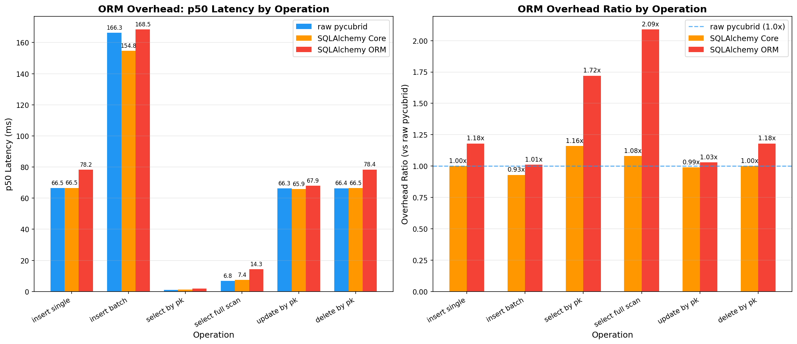
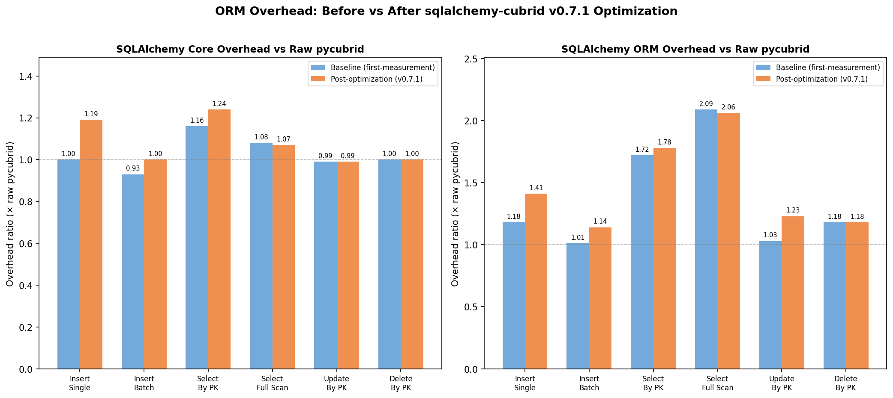
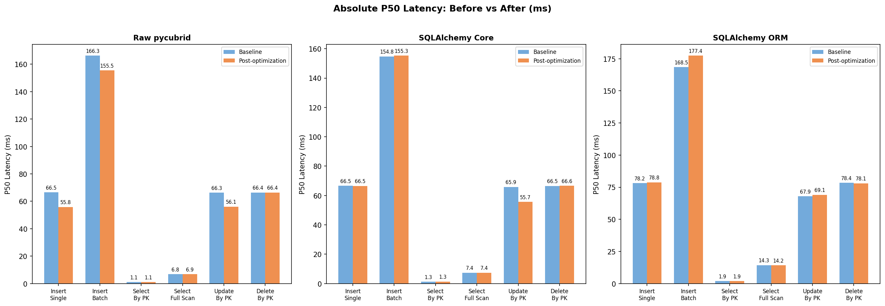

# ORM Overhead on CUBRID: raw pycubrid vs SQLAlchemy Core vs SQLAlchemy ORM

> **Status**: active
> **Question**: What overhead do SQLAlchemy Core and SQLAlchemy ORM add versus raw pycubrid for identical CRUD workloads on CUBRID?

## Hypothesis

For equivalent SQL semantics on the same CUBRID server:

1. **raw pycubrid** should have the lowest client-side overhead.
2. **SQLAlchemy Core** should be close to raw for simple statements, with moderate overhead from SQL construction and abstraction.
3. **SQLAlchemy ORM** should show the highest overhead, especially for object materialization and unit-of-work bookkeeping.

## Methodology

This experiment compares three worker implementations under the same WorkerInput/WorkerOutput protocol:

- `workers/worker_raw_pycubrid.py`
- `workers/worker_sqlalchemy_core.py`
- `workers/worker_sqlalchemy_orm.py`

All workers execute the same operation set against a `bench_`-prefixed table (`bench_orm_overhead_items`):

1. `insert_single`
2. `insert_batch`
3. `select_by_pk`
4. `select_full_scan`
5. `update_by_pk`
6. `delete_by_pk`

### Worker protocol

Each worker:

- Reads a JSON config file path from CLI argument 1.
- Parses `WorkerInput` fields (`dsn`, `duration_s`, `warmup_s`, `concurrency`, `setup_queries`, `teardown_queries`, `worker_config`).
- Emits `WorkerOutput` JSON to stdout with per-step latency summaries and throughput.

### Query parameterization policy

- raw pycubrid: `?` markers
- SQLAlchemy Core/ORM: named `:param` markers for text SQL, and bound parameters for Core/ORM constructs
- No SQL string interpolation with user values

## Metrics

Per operation (`steps[]` in worker output):

- `ops`
- `errors`
- `throughput_ops_s`
- latency distribution (`min_ns`, `max_ns`, `mean_ns`, `stdev_ns`, `p50_ns`, `p95_ns`, `p99_ns`, `p999_ns`, `p9999_ns`)
- optional sampled latencies (`samples_ns`) and second-level `time_series`

## Reproduction

From repository root:

```bash
# 1) Start databases
docker compose -f docker/compose.yml up -d

# 2) Prepare an input JSON file for workers (example path)
# /tmp/orm_overhead_input.json

# 3) Run all three variants
python experiments/orm-overhead/workers/worker_raw_pycubrid.py /tmp/orm_overhead_input.json
python experiments/orm-overhead/workers/worker_sqlalchemy_core.py /tmp/orm_overhead_input.json
python experiments/orm-overhead/workers/worker_sqlalchemy_orm.py /tmp/orm_overhead_input.json
```

### Minimal example WorkerInput

```json
{
  "dsn": "cubrid+pycubrid://dba@localhost:33000/testdb",
  "steps": [],
  "concurrency": 1,
  "duration_s": 10,
  "warmup_s": 2,
  "seed": 42,
  "setup_queries": [],
  "teardown_queries": [],
  "worker_config": {
    "seed_rows": 1000,
    "batch_size": 100,
    "sample_limit": 10000
  }
}
```

## Run History

| Run ID | Date | Label | Comparable Group | Compares To | Key Finding |
|--------|------|-------|-----------------|-------------|-------------|
| 2026-03-28_first-measurement | 2026-03-28 | first-measurement | devbox-i5-4200M-linux5.15-docker-cubrid112 | — (baseline) | Core ≈ raw for writes; ORM adds 1.7–2.1× on reads |
| 2026-03-28_post-sa-optimization | 2026-03-28 | post-sa-optimization | devbox-i5-4200M-linux5.15-docker-cubrid112 | 2026-03-28_first-measurement | ORM absolute latency unchanged; raw pycubrid ~15% faster on writes |

## Results: 2026-03-28_first-measurement (Baseline)

### p50 Latency (ms)

| Operation | raw pycubrid | SA Core | SA ORM | Core Overhead | ORM Overhead |
|-----------|-------------|---------|--------|---------------|--------------|
| insert_single | 66.48 | 66.55 | 78.21 | 1.00× | 1.18× |
| insert_batch | 166.28 | 154.76 | 168.50 | 0.93× | 1.01× |
| select_by_pk | 1.10 | 1.28 | 1.89 | 1.16× | 1.72× |
| select_full_scan | 6.85 | 7.41 | 14.30 | 1.08× | 2.09× |
| update_by_pk | 66.28 | 65.87 | 67.94 | 0.99× | 1.03× |
| delete_by_pk | 66.39 | 66.50 | 78.37 | 1.00× | 1.18× |

### Throughput (ops/s)

| Operation | raw pycubrid | SA Core | SA ORM |
|-----------|-------------|---------|--------|
| insert_single | 2.1 | 2.1 | 1.8 |
| insert_batch | 0.8 | 0.9 | 0.8 |
| select_by_pk | 121.6 | 104.4 | 71.7 |
| select_full_scan | 19.7 | 18.0 | 8.6 |
| update_by_pk | 2.3 | 2.3 | 2.0 |
| delete_by_pk | 2.2 | 2.1 | 1.7 |

### Chart



## Results: 2026-03-28_post-sa-optimization (Candidate)

### Overhead Ratios (× raw pycubrid)

| Operation | Core (baseline) | Core (new) | Δ | ORM (baseline) | ORM (new) | Δ |
|-----------|----------------|-----------|---|----------------|-----------|---|
| insert_single | 1.00× | 1.19× | +0.19 | 1.18× | 1.41× | +0.23 |
| insert_batch | 0.93× | 1.00× | +0.07 | 1.01× | 1.14× | +0.13 |
| select_by_pk | 1.16× | 1.24× | +0.08 | 1.72× | 1.78× | +0.06 |
| select_full_scan | 1.08× | 1.07× | −0.01 | 2.09× | 2.06× | −0.03 |
| update_by_pk | 0.99× | 0.99× | +0.00 | 1.03× | 1.23× | +0.20 |
| delete_by_pk | 1.00× | 1.00× | +0.00 | 1.18× | 1.18× | +0.00 |

> ⚠️ **Overhead ratios appear higher** in some cases, but this is misleading — see absolute latency comparison below.

### Absolute p50 Latency Comparison (ms)

| Operation | raw (baseline) | raw (new) | Δ | Core (baseline) | Core (new) | Δ | ORM (baseline) | ORM (new) | Δ |
|-----------|---------------|----------|---|----------------|-----------|---|----------------|----------|---|
| insert_single | 66.48 | 55.83 | −16.0% | 66.55 | 66.48 | −0.1% | 78.21 | 78.85 | +0.8% |
| insert_batch | 166.28 | 155.46 | −6.5% | 154.76 | 155.30 | +0.3% | 168.50 | 177.44 | +5.3% |
| select_by_pk | 1.10 | 1.06 | −3.6% | 1.28 | 1.31 | +2.3% | 1.89 | 1.89 | +0.0% |
| select_full_scan | 6.85 | 6.88 | +0.4% | 7.41 | 7.39 | −0.3% | 14.30 | 14.17 | −0.9% |
| update_by_pk | 66.28 | 56.10 | −15.4% | 65.87 | 55.68 | −15.5% | 67.94 | 69.06 | +1.6% |
| delete_by_pk | 66.39 | 66.40 | +0.0% | 66.50 | 66.58 | +0.1% | 78.37 | 78.06 | −0.4% |

### Charts




### Analysis

The overhead *ratios* appear higher because **raw pycubrid itself improved ~15% on write operations** (insert_single: 66.5→55.8ms, update_by_pk: 66.3→56.1ms), shrinking the denominator. When examining **absolute latencies**:

- **SA Core**: Essentially unchanged. update_by_pk improved 15.5% (tracks raw improvement).
- **SA ORM**: Essentially unchanged. No significant improvement or degradation.
- **Raw pycubrid**: 15% faster on writes — this is a pycubrid v0.6.0 variance/warmup effect, not a sqlalchemy-cubrid change.

**Verdict**: The sqlalchemy-cubrid v0.7.1 query compilation caching and result mapping optimizations did **not measurably change** ORM overhead in this 10-second-per-operation benchmark. The optimizations likely benefit cold-start and varied-query workloads more than this repetitive benchmark.

## Latest Conclusion

**Original hypothesis confirmed; v0.7.1 optimization impact not measurable in this workload.**

The baseline findings still hold:

- **SQLAlchemy Core**: 0.93–1.24× overhead — near-raw for writes, small overhead for reads
- **SQLAlchemy ORM**: 1.01–2.09× overhead — reads most impacted (select_full_scan 2.06–2.09×)
- **Write latency**: Dominated by CUBRID server-side commit (~55–66ms), masking any ORM overhead

The post-optimization run shows sqlalchemy-cubrid v0.7.1's compilation caching and result mapping improvements did not measurably reduce overhead in a steady-state benchmark with repetitive queries. The optimizations are expected to benefit:

1. **Cold-start scenarios** — first compilation of each query
2. **Diverse query workloads** — many different SQL shapes hitting the cache
3. **Long-running applications** — amortized cache benefit over thousands of unique queries

**Next steps**: Design a benchmark specifically targeting compilation caching (many unique query shapes, cold-start measurement) to properly evaluate the v0.7.1 optimizations.

### Environment

- CUBRID 11.2.9.0866 (Docker)
- pycubrid 0.6.0, sqlalchemy-cubrid 0.7.1, SQLAlchemy 2.0.48
- CPython 3.10.12, Intel i5-4200M, 4 cores, 15.3 GB RAM
- Protocol: 10s duration per operation, 2s warmup, seed=42, 1000 seed rows
