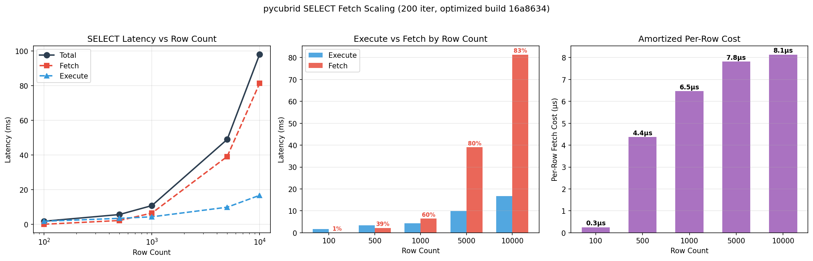

# Row-Count Sweep: pycubrid SELECT Fetch Scaling

> **Date**: 2026-03-27
> **Purpose**: Measure how pycubrid SELECT fetch latency scales with result set size.
> **Status**: Active — establishes scaling baseline after parse-path optimization.

## Question

At what row count does pycubrid's Python-side parsing overhead become the dominant
cost in SELECT operations? How does per-row fetch cost amortize?

## Methodology

- **Query**: `SELECT id, name, email, age FROM bench_sweep WHERE id <= N`
- **Row counts**: 100, 500, 1,000, 5,000, 10,000
- **Table**: 4 columns (INT, VARCHAR(100), VARCHAR(200), INT)
- **Iterations**: 200 measured + 50 warmup (per row count)
- **Timer**: `time.perf_counter_ns()`
- **Phases**: Execute and Fetch measured independently

## Results (2026-03-27, pycubrid 0.5.0+16a8634)

| Rows | Execute (ms) | Fetch (ms) | Total (ms) | Fetch % | Per-Row (µs) |
|-----:|------------:|-----------:|-----------:|--------:|-------------:|
| 100 | 1.756 | 0.025 | 1.781 | 1.4% | 0.3 |
| 500 | 3.443 | 2.184 | 5.627 | 38.8% | 4.4 |
| 1,000 | 4.317 | 6.464 | 10.781 | 59.9% | 6.5 |
| 5,000 | 9.853 | 39.090 | 48.943 | 79.9% | 7.8 |
| 10,000 | 16.718 | 81.330 | 98.047 | 83.0% | 8.1 |

## Analysis

### Scaling Behavior

Fetch latency scales **linearly** with row count above ~500 rows. The per-row cost
stabilizes around **7.8–8.1 µs/row** for larger result sets.

### Crossover Point

At **~500 rows**, fetch time equals execute time (both ~2–3ms). Below 500 rows,
execute dominates (server round-trip). Above 500 rows, fetch dominates (Python parsing).

### Fetch Fraction

| Row Count | Fetch as % of Total |
|----------:|-------------------:|
| 100 | 1.4% |
| 500 | 38.8% |
| 1,000 | 59.9% |
| 5,000 | 79.9% |
| 10,000 | 83.0% |

At 10K rows, Python row parsing accounts for **83%** of total SELECT latency.

### Per-Row Cost Breakdown

The amortized per-row fetch cost at 100 rows (0.3µs) is artificially low because it
includes fixed overhead amortized across few rows. The true per-row parsing cost is
**~8 µs/row** (stable from 5K+ rows).

This 8µs/row includes:
- `_read_value()` dispatch table lookup
- `_parse_int()` / `_parse_bytes()` for each column
- `struct.unpack_from()` calls
- Row tuple construction

## Implications

1. **Optimization ceiling**: For result sets < 500 rows, driver optimization has
   negligible impact — server round-trip dominates.
2. **Sweet spot**: Optimization provides maximum value for 1K–10K+ row result sets.
3. **Next target**: Reducing the ~8µs/row cost requires batch `struct.unpack` or
   C extension for the inner parse loop.

## Run History

| Run ID | Date | Role | pycubrid | Notes |
|--------|------|------|----------|-------|
| `2026-03-27_initial` | 2026-03-27 | baseline | 0.5.0+16a8634 | Post-optimization scaling baseline |
